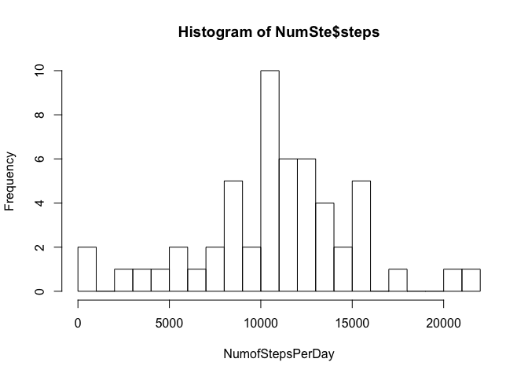
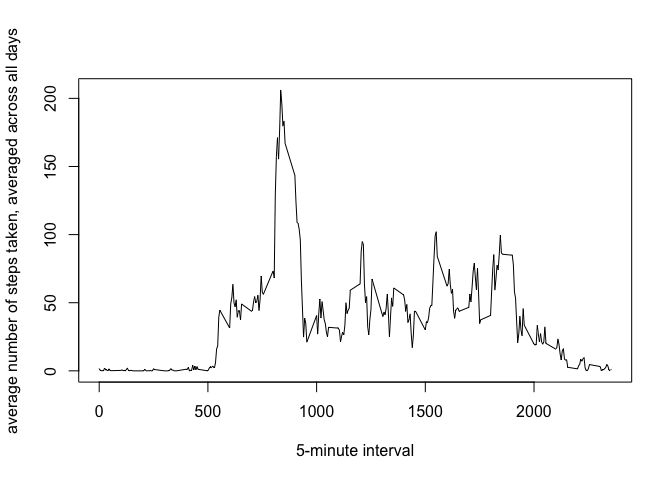
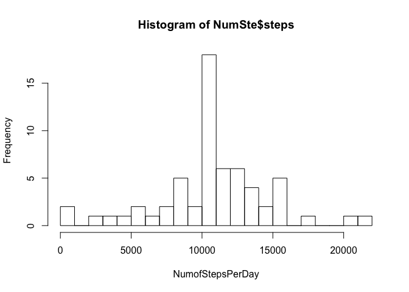
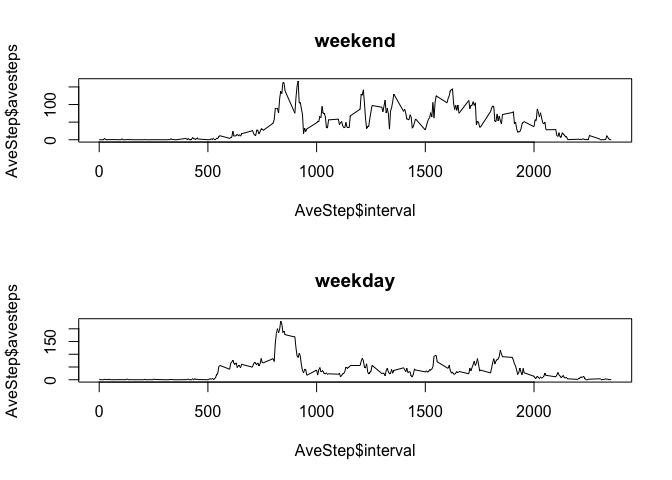

# Reproducible Research: Peer Assessment 1


```r
library(dplyr)
```

```
## 
## Attaching package: 'dplyr'
## 
## The following object is masked from 'package:stats':
## 
##     filter
## 
## The following objects are masked from 'package:base':
## 
##     intersect, setdiff, setequal, union
```

## Loading and preprocessing the data

1.Load the data:

```r
ActiveData <- read.csv(file = '/Users//xiao_lisp/Downloads/activity.csv',header = TRUE)
```


## What is mean total number of steps taken per day?


```r
que1 <- group_by(ActiveData,date)
## total number of steps taken per day
NumSte <- summarise(que1,sum(steps))
names(NumSte)<-c('date','steps')
hist(NumSte$steps,breaks = 20,xlab = 'NumofStepsPerDay')
```

 

3.mean and median of the total number of steps taken per day


```r
mean(NumSte$steps,na.rm = TRUE)
```

```
## [1] 10766.19
```

```r
median(NumSte$steps,na.rm = TRUE)
```

```
## [1] 10765
```


## What is the average daily activity pattern?


```r
Que2 <- group_by(ActiveData,interval)
AveStep <- summarise(Que2,mean(steps,na.rm = TRUE))
names(AveStep) <- c('interval','avesteps')
plot(x= AveStep$interval,y= AveStep$avesteps,type = 'l',xlab = '5-minute interval',ylab = 'average number of steps taken, averaged across all days')
```

 

```r
AveStep$interval[which(AveStep$avesteps ==max(AveStep$avesteps))]
```

```
## [1] 835
```


## Imputing missing values


use the means for the 5-minute intervals as fillers for missing values.

```r
sum(is.na(ActiveData))
```

```
## [1] 2304
```

```r
#ActiveData$steps[is.na(ActiveData$steps)] <- mean(NumSte$steps,na.rm = TRUE)
NewActive <- merge(ActiveData,AveStep,by = 'interval')
NewActive$steps[is.na(NewActive$steps)] <- NewActive$avesteps[is.na(NewActive$steps)]
###Histgram
que3 <- group_by(NewActive,date)
## total number of steps taken per day
NumSte <- summarise(que3,sum(steps))
names(NumSte)<-c('date','steps')
hist(NumSte$steps,xlab = 'NumofStepsPerDay',breaks = 20)
```

 

```r
mean(NumSte$steps)
```

```
## [1] 10766.19
```

```r
median(NumSte$steps)
```

```
## [1] 10766.19
```

these values differ from the estimates from the first part of the assignment!

## Are there differences in activity patterns between weekdays and weekends?


```r
daytype <- function(date) {
    if (weekdays(as.Date(date)) %in% c("Saturday", "Sunday")) {
        "weekend"
    } else {
        "weekday"
    }
}
NewActive <- NewActive[,1:3]
NewActive$daytype <- as.factor(sapply(NewActive$date, daytype))
```

Make a panel plot containing a time series plot (i.e. type = "l") of the 5-minute interval (x-axis) and the average number of steps taken, averaged across all weekday days or weekend days (y-axis).

```r
par(mfrow=c(2,1))
for(i in c("weekend", "weekday")){
temp <- subset(NewActive,NewActive$daytype == i)
Que4 <- group_by(temp,interval)
AveStep <- summarise(Que4,mean(steps,na.rm = TRUE))
names(AveStep) <- c('interval','avesteps')
plot(x= AveStep$interval,y= AveStep$avesteps,type = 'l',main=i)
}
```

 
